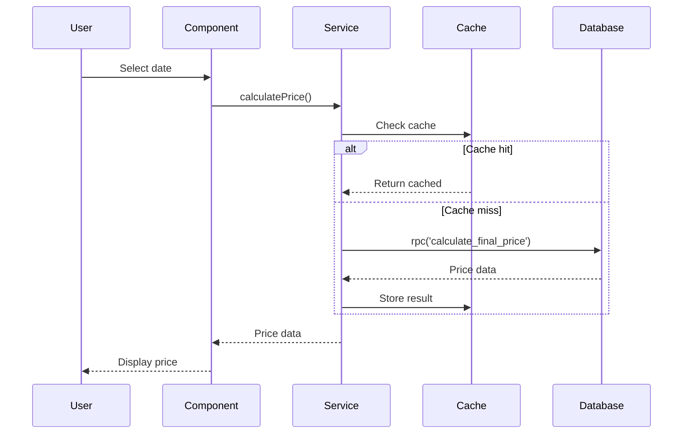
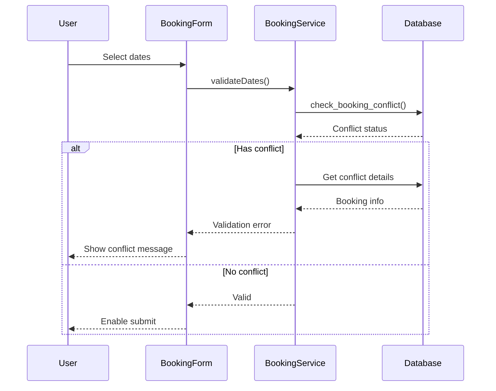
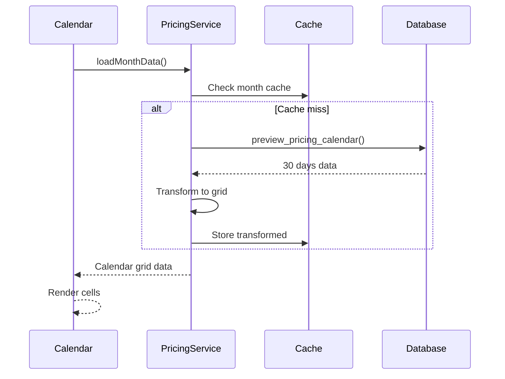

# Database Functions UI Mapping Documentation

## Overview
This document provides comprehensive mapping between Supabase database functions and React UI components, including integration patterns, data flows, and error handling requirements.

## Table of Contents
1. [Core Pricing Functions](#core-pricing-functions)
2. [Validation Functions](#validation-functions)
3. [Management Functions](#management-functions)
4. [Data Flow Patterns](#data-flow-patterns)
5. [Error Handling Strategy](#error-handling-strategy)
6. [Performance Optimizations](#performance-optimizations)

## Core Pricing Functions

### calculate_final_price()

**Database Function Signature:**
```sql
calculate_final_price(
  p_property_id TEXT,  -- lodgify_property_id
  p_check_date DATE,
  p_nights INTEGER
) RETURNS TABLE (
  base_price NUMERIC,
  seasonal_adjustment NUMERIC,
  last_minute_discount NUMERIC,
  final_price_per_night NUMERIC,
  total_price NUMERIC,
  min_price_enforced BOOLEAN
)
```

**UI Component Mappings:**

#### PricingCalendarGrid Component
- **Usage**: Display individual day prices in calendar cells
- **Pattern**: Single date calculation on hover/click
- **Service Method**: `pricingService.calculateDetailedPrice()`
- **Example**:
```typescript
const handleCellClick = async (date: Date) => {
  const priceData = await pricingService.calculateDetailedPrice(
    propertyId,
    date,
    defaultNights,
    { forceRefresh: true }
  )
  setPricePreview(priceData)
}
```

#### BookingForm Component
- **Usage**: Calculate total price during booking creation
- **Pattern**: Real-time price update on date selection
- **Service Method**: `pricingService.calculateDetailedPrice()`
- **Example**:
```typescript
const updateBookingPrice = async () => {
  const nights = calculateNights(arrivalDate, departureDate)
  const priceData = await pricingService.calculateDetailedPrice(
    propertyId,
    arrivalDate,
    nights
  )
  setTotalPrice(priceData.total_price)
}
```

#### PricePreviewModal Component
- **Usage**: Show detailed price breakdown
- **Pattern**: On-demand calculation with full breakdown display
- **Service Method**: Direct function call for detailed analysis
- **Example**:
```typescript
const loadPriceBreakdown = async () => {
  const breakdown = await pricingService.calculateDetailedPrice(
    propertyId,
    selectedDate,
    nights,
    { forceRefresh: true }
  )
  setBreakdown({
    base: breakdown.base_price,
    seasonal: breakdown.seasonal_adjustment,
    discount: breakdown.last_minute_discount,
    final: breakdown.final_price_per_night,
    total: breakdown.total_price,
    atMinimum: breakdown.min_price_enforced
  })
}
```

#### PropertyPricingDashboard Component
- **Usage**: Summary statistics and averages
- **Pattern**: Batch calculations for analytics
- **Service Method**: Multiple calls aggregated
- **Performance**: Use preview_pricing_calendar instead for bulk operations

### preview_pricing_calendar()

**Database Function Signature:**
```sql
preview_pricing_calendar(
  p_property_id TEXT,
  p_start_date DATE,
  p_end_date DATE,
  p_nights INTEGER
) RETURNS TABLE (
  check_date DATE,
  base_price NUMERIC,
  seasonal_adjustment_percent NUMERIC,
  last_minute_discount_percent NUMERIC,
  final_price_per_night NUMERIC,
  total_price NUMERIC,
  min_price_enforced BOOLEAN,
  days_from_today INTEGER,
  savings_amount NUMERIC,
  savings_percent NUMERIC
)
```

**UI Component Mappings:**

#### PricingCalendarGrid Component
- **Usage**: Efficient bulk loading of monthly data
- **Pattern**: Single call for entire month view
- **Service Method**: `pricingService.loadCalendarData()`
- **Performance**: <2 seconds for 30-day period
- **Example**:
```typescript
const loadMonthData = async (year: number, month: number) => {
  const startDate = new Date(year, month, 1)
  const endDate = new Date(year, month + 1, 0)
  
  const calendarData = await pricingService.loadCalendarData(
    propertyId,
    { start: startDate, end: endDate },
    defaultNights
  )
  
  setCalendarCells(transformToGrid(calendarData))
}
```

#### PricingAnalytics Component
- **Usage**: Generate pricing trends and statistics
- **Pattern**: Large date range analysis
- **Service Method**: `pricingService.loadCalendarData()`
- **Performance**: Paginate for >90 day ranges

### get_last_minute_discount()

**Database Function Signature:**
```sql
get_last_minute_discount(
  p_property_id TEXT,
  p_days_before_checkin INTEGER,
  p_nights INTEGER DEFAULT 1,
  p_check_date DATE DEFAULT CURRENT_DATE
) RETURNS NUMERIC
```

**UI Component Mappings:**

#### DiscountPreviewModal Component
- **Usage**: Preview discount impact
- **Pattern**: Real-time calculation during strategy configuration
- **Service Method**: `pricingService.getLastMinuteDiscount()`
- **Example**:
```typescript
const previewDiscount = async (daysOut: number) => {
  const discount = await pricingService.getLastMinuteDiscount(
    propertyId,
    daysOut,
    nights,
    checkDate
  )
  setDiscountAmount(basePrice * discount)
}
```

#### BookingForm Component
- **Usage**: Apply discounts during booking
- **Pattern**: Automatic calculation based on booking date
- **Service Method**: Integrated into price calculation

## Validation Functions

### check_booking_conflict()

**Database Function Signature:**
```sql
check_booking_conflict(
  p_property_id TEXT,
  p_arrival_date DATE,
  p_departure_date DATE,
  p_exclude_booking_id TEXT DEFAULT NULL
) RETURNS BOOLEAN
```

**UI Component Mappings:**

#### BookingForm Component
- **Usage**: Real-time validation during date selection
- **Pattern**: Debounced validation on date change
- **Service Method**: `bookingService.validateDates()`
- **Example**:
```typescript
const validateBookingDates = useMemo(
  () => debounce(async (arrival: Date, departure: Date) => {
    const validation = await bookingService.validateDates(
      propertyId,
      arrival,
      departure
    )
    
    if (!validation.isValid) {
      setErrors(validation.errors)
      setSubmitEnabled(false)
    } else {
      setErrors([])
      setSubmitEnabled(true)
    }
  }, 500),
  [propertyId]
)
```

#### CalendarAvailability Component
- **Usage**: Mark unavailable dates in calendar
- **Pattern**: Bulk check for month view
- **Service Method**: `bookingService.getOverlappingBookings()`

#### BookingEditForm Component
- **Usage**: Validate date changes for existing bookings
- **Pattern**: Exclude current booking from conflict check
- **Service Method**: `bookingService.validateDates()` with excludeBookingId

## Management Functions

### Property CRUD Operations

**Direct Table Access via Supabase Client**

#### PropertySelection Component
- **Usage**: List and select properties
- **Pattern**: Direct query with filtering
- **Example**:
```typescript
const loadProperties = async () => {
  const { data, error } = await supabase
    .from('properties')
    .select('*')
    .order('property_name')
  
  if (error) throw new DatabaseError(error.message)
  setProperties(data)
}
```

#### PropertyEditForm Component
- **Usage**: Update property details
- **Pattern**: Optimistic updates with rollback
- **Service Method**: `pricingService.updateBasePrice()`

### Seasonal Rate Management

**Direct Table Access: date_ranges**

#### SeasonalRateManager Component
- **Usage**: CRUD operations for seasonal rates
- **Pattern**: Constraint-aware validation
- **Example**:
```typescript
const addSeasonalRate = async (rate: NewSeasonalRate) => {
  // Check for overlaps before insert
  const { data: overlaps } = await supabase
    .from('date_ranges')
    .select('rate_id')
    .or(`and(start_date.lte.${rate.end_date},end_date.gte.${rate.start_date})`)
  
  if (overlaps?.length > 0) {
    throw new ValidationError('Date range overlaps with existing rate')
  }
  
  const { error } = await supabase
    .from('date_ranges')
    .insert(rate)
  
  if (error) throw new DatabaseError(error.message)
}
```

### Discount Strategy Management

**Functions: apply_discount_to_all_properties(), remove_all_discounts(), copy_discount_strategy()**

#### DiscountStrategyManager Component
- **Usage**: Configure and apply discount strategies
- **Pattern**: Global template with property-specific application
- **Service Method**: `discountService` methods
- **Example**:
```typescript
const applyGlobalStrategy = async (strategyId: string) => {
  const affectedCount = await discountService.applyToAllProperties(strategyId)
  showSuccess(`Strategy applied to ${affectedCount} properties`)
  refreshPropertyDiscounts()
}
```

## Data Flow Patterns

### Pricing Calculation Flow



### Booking Validation Flow



### Bulk Calendar Loading Flow



## Error Handling Strategy

### Database Connection Errors
```typescript
// Pattern: Retry with exponential backoff
async function retryWithBackoff<T>(
  fn: () => Promise<T>,
  maxRetries = 3,
  baseDelay = 1000
): Promise<T> {
  for (let i = 0; i < maxRetries; i++) {
    try {
      return await fn()
    } catch (error) {
      if (i === maxRetries - 1) throw error
      
      const delay = baseDelay * Math.pow(2, i)
      await new Promise(resolve => setTimeout(resolve, delay))
    }
  }
  throw new Error('Max retries exceeded')
}

// Usage in service
const result = await retryWithBackoff(() => 
  supabase.rpc('calculate_final_price', params)
)
```

### Constraint Violation Errors
```typescript
// Pattern: Specific error messages with recovery guidance
catch (error) {
  if (error.code === '23P01') {  // Exclusion constraint
    throw new ValidationError(
      'Date range overlaps with existing seasonal rate. Please adjust dates.',
      { suggestion: 'View existing rates to find available periods' }
    )
  }
  
  if (error.code === '23505') {  // Unique constraint
    throw new BookingConflictError(
      'A booking already exists for these dates.',
      { suggestion: 'Check availability calendar for alternative dates' }
    )
  }
}
```

### Parameter Validation Errors
```typescript
// Pattern: Client-side pre-validation
const validateBeforeCall = (params: PricingParams): void => {
  const errors: string[] = []
  
  if (!params.propertyId) {
    errors.push('Property selection required')
  }
  
  if (params.nights < 1 || params.nights > 365) {
    errors.push('Stay duration must be 1-365 nights')
  }
  
  if (params.date < new Date()) {
    errors.push('Cannot calculate prices for past dates')
  }
  
  if (errors.length > 0) {
    throw new ValidationError(errors.join(', '))
  }
}
```

## Performance Optimizations

### Caching Strategy

```typescript
// Cache key patterns for different data types
const CacheKeys = {
  // 6-hour cache for pricing
  pricing: (propId: string, date: string, nights: number) =>
    `pricing:${propId}:${date}:${nights}`,
  
  // 6-hour cache for full month
  calendar: (propId: string, year: number, month: number) =>
    `calendar:${propId}:${year}:${month}`,
  
  // 1-hour cache for discounts (changes frequently)
  discount: (propId: string, daysOut: number) =>
    `discount:${propId}:${daysOut}`,
  
  // 30-minute cache for conflicts (bookings change)
  conflict: (propId: string, arrival: string, departure: string) =>
    `conflict:${propId}:${arrival}:${departure}`
}
```

### Batching Patterns

```typescript
// Pattern: Batch multiple operations
async function batchPriceUpdates(updates: PriceUpdate[]) {
  const batchSize = 10
  const results = []
  
  for (let i = 0; i < updates.length; i += batchSize) {
    const batch = updates.slice(i, i + batchSize)
    const batchResults = await Promise.allSettled(
      batch.map(update => updatePrice(update))
    )
    results.push(...batchResults)
  }
  
  return results
}
```

### Query Optimization

```typescript
// Pattern: Use bulk functions instead of loops
// BAD - Multiple database calls
for (const date of dates) {
  const price = await calculatePrice(propertyId, date, nights)
  prices.push(price)
}

// GOOD - Single bulk call
const prices = await supabase.rpc('preview_pricing_calendar', {
  p_property_id: propertyId,
  p_start_date: dates[0],
  p_end_date: dates[dates.length - 1],
  p_nights: nights
})
```

## Testing Patterns

### Unit Testing Services
```typescript
describe('PricingService', () => {
  it('should calculate price with all components', async () => {
    const result = await pricingService.calculateDetailedPrice(
      '327020',
      new Date('2024-07-15'),
      3
    )
    
    expect(result).toMatchObject({
      base_price: expect.any(Number),
      final_price_per_night: expect.any(Number),
      total_price: expect.any(Number),
      min_price_enforced: expect.any(Boolean)
    })
    
    expect(result.total_price).toBeGreaterThan(0)
  })
})
```

### Integration Testing
```typescript
describe('Booking Validation Integration', () => {
  it('should detect booking conflicts', async () => {
    // Create a test booking
    const testBooking = await createTestBooking({
      propertyId: '327020',
      arrival: '2024-07-10',
      departure: '2024-07-15'
    })
    
    // Attempt conflicting booking
    const validation = await bookingService.validateDates(
      '327020',
      new Date('2024-07-12'),
      new Date('2024-07-17')
    )
    
    expect(validation.isValid).toBe(false)
    expect(validation.conflictDetails).toBeDefined()
    
    // Cleanup
    await deleteTestBooking(testBooking.id)
  })
})
```

## Component Integration Examples

### React Hook Pattern
```typescript
// usePricingCalendar.ts
export function usePricingCalendar(propertyId: string) {
  const [data, setData] = useState<PricingCalendarData | null>(null)
  const [loading, setLoading] = useState(false)
  const [error, setError] = useState<Error | null>(null)
  
  const loadCalendar = useCallback(async (year: number, month: number) => {
    setLoading(true)
    setError(null)
    
    try {
      const calendar = await pricingService.loadPricingCalendar(
        propertyId,
        year,
        month
      )
      setData(calendar)
    } catch (err) {
      setError(err as Error)
    } finally {
      setLoading(false)
    }
  }, [propertyId])
  
  return { data, loading, error, loadCalendar }
}
```

### Error Boundary Pattern
```typescript
// PricingErrorBoundary.tsx
class PricingErrorBoundary extends Component {
  state = { hasError: false, error: null }
  
  static getDerivedStateFromError(error: Error) {
    if (error instanceof PricingCalculationError) {
      return {
        hasError: true,
        error: {
          message: 'Unable to calculate pricing. Please try again.',
          details: error.details
        }
      }
    }
    return { hasError: true, error }
  }
  
  render() {
    if (this.state.hasError) {
      return <ErrorDisplay error={this.state.error} />
    }
    return this.props.children
  }
}
```

## Summary

This mapping document provides:
1. **Complete function signatures** for all database functions
2. **UI component mappings** showing which components use each function
3. **Integration patterns** with code examples
4. **Data flow diagrams** for complex operations
5. **Error handling strategies** for different error types
6. **Performance optimizations** including caching and batching
7. **Testing patterns** for validation

Key principles:
- All pricing calculations use database functions exclusively
- Bulk operations use `preview_pricing_calendar()` for efficiency
- Error handling provides actionable recovery guidance
- Caching reduces database load while maintaining accuracy
- Type safety enforced through TypeScript interfaces